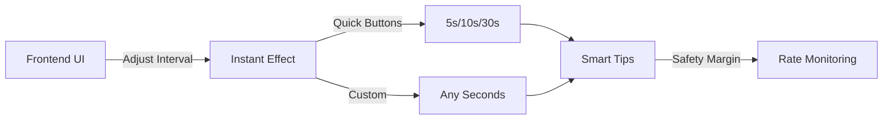
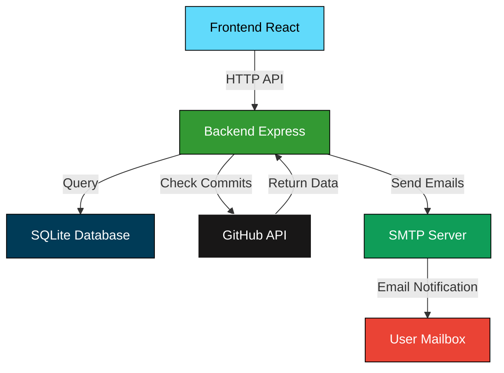
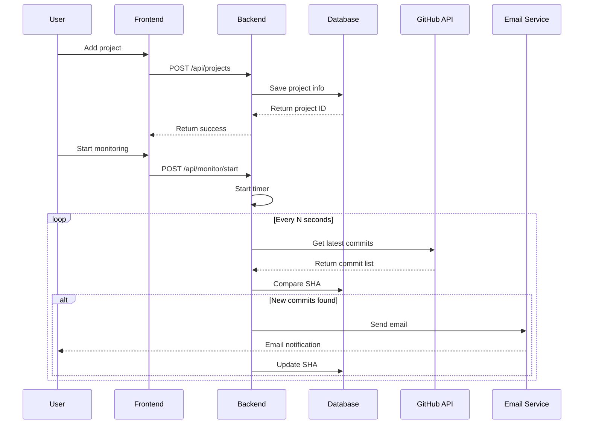

<div align="center">

<h1>🔍 GitHub Monitor & Email Notification System</h1>

<p><i>Real-time GitHub repository monitoring with beautiful email notifications</i></p>

[](https://github.com/24373054/GitSentinel-Mailer/stargazers)
[](https://github.com/24373054/GitSentinel-Mailer/network)
[](https://github.com/24373054/GitSentinel-Mailer/issues)
[](https://github.com/24373054/GitSentinel-Mailer/blob/main/LICENSE)

[](https://nodejs.org/)
[](https://reactjs.org/)
[](https://expressjs.com/)
[](https://www.sqlite.org/)

[English](./README-EN.md) | [中文文档](./README.md)

</div>

---

## 📖 Introduction

**GitHub Monitor & Email Notification System** is a powerful and elegant repository monitoring tool. It tracks your GitHub repositories in real-time and sends beautiful email notifications instantly when new commits are detected.

### ✨ Key Features

<table>
<tr>
<td width="25%" align="center">

🔗  
**Full Monitoring**  
5s-1h adjustable

</td>
<td width="25%" align="center">

🎨  
**5 Email Themes**  
Personalized styles

</td>
<td width="25%" align="center">

⚙️  
**Dynamic Config**  
Real-time adjustment

</td>
<td width="25%" align="center">

📊  
**Smart Management**  
Rate limit monitoring

</td>
</tr>
</table>

---

## 🌟 Feature Highlights

### 1. Project Management

- ✅ Add/Edit/Delete monitoring projects
- ✅ Support multiple simultaneous monitoring
- ✅ Persistent storage (SQLite)
- ✅ Real-time status display

### 2. Real-time Monitoring

- ⚡ Flexible monitoring intervals (5s-1h)
- 🔄 Auto-detect new commits
- 📝 Record detailed commit info (author, time, content)
- 🎯 Precise SHA comparison

### 3. Dynamic Monitoring Interval ⭐ Featured

<div align="center">



</div>

- 🎛️ Adjust monitoring frequency from frontend
- 🚀 6 quick presets (5s, 10s, 30s, 1min, 5min, 10min)
- 📊 Real-time usage and safety margin display
- ⚠️ Smart rate limit warnings
- 🔄 Changes take effect immediately

### 4. Email Theme System ⭐ Featured

<table>
<tr>
<td width="20%" align="center">

🎨  
**Default**  
Blue-Purple Gradient

</td>
<td width="20%" align="center">

⬡  
**Yingzhouji**  
Cyber Epic

</td>
<td width="20%" align="center">

⚪  
**Minimal**  
Black & White

</td>
<td width="20%" align="center">

🟠  
**Warm**  
Orange Sunshine

</td>
<td width="20%" align="center">

🟢  
**Fresh**  
Natural Green

</td>
</tr>
</table>

#### Yingzhouji Theme Features

Perfect match for game-style email theme:

- 🌌 Deep blue-black background (#0a0e27)
- ✨ Cyan neon glow effect (#00d4ff)
- 📐 Matrix grid background
- 🔮 Blockchain ledger-style copywriting
- 💎 Monospace font code display

### 5. Smart Alert System

- 📈 Real-time API usage display
- ⚠️ Rate limit warnings
- 💡 Optimization suggestions
- 🔑 GitHub Token status detection

---

## 🚀 Quick Start

### Requirements

<div align="center">

| Tool | Version | Description |
|:---:|:---:|:---|
| Node.js | >= 14.0 | JavaScript runtime |
| npm | >= 6.0 | Package manager |
| Git | Latest | Version control |

</div>

### 📦 Installation

```bash
# Clone the repository
git clone https://github.com/24373054/GitSentinel-Mailer.git
cd GitSentinel-Mailer

# Install backend dependencies
npm install

# Install frontend dependencies
cd client
npm install
cd ..
```

Or use one-click installation:

```bash
# Windows users
.\install.bat

# Linux/Mac users
chmod +x install.sh && ./install.sh
```

### ⚙️ Configuration

Create `.env` file in project root:

```env
# GitHub Token (optional, increases rate limit)
GITHUB_TOKEN=your_github_token_here

# Server port (optional)
PORT=5000
```

### 🎯 Start Services

```bash
# Development mode (start both frontend and backend)
npm run dev

# Or start separately
npm run server  # Backend (port: 5000)
npm run client  # Frontend (port: 3000)
```

### 🌐 Access Application

Open browser and visit:

- **Frontend**: http://localhost:3000
- **Backend API**: http://localhost:5000

---

## 📱 User Guide

<div align="center">

### Three Steps to Start Monitoring

</div>

<table>
<tr>
<td width="33%" align="center">

### 1️⃣ Add Project

Fill repository address  
Set notification email  
Choose email theme

</td>
<td width="33%" align="center">

### 2️⃣ Adjust Interval

Set monitoring frequency  
Check usage estimation  
Confirm safety margin

</td>
<td width="33%" align="center">

### 3️⃣ Start Monitoring

Click start button  
Receive notifications  
Check status anytime

</td>
</tr>
</table>

### Detailed Steps

#### Add Monitoring Project

1. Fill in the left form:
   - **Repository**: Format `owner/repo` (e.g., `facebook/react`)
   - **Email**: Your notification email address
   - **Theme**: Choose your preferred email style

2. Click "➕ Add Project" button

3. Project appears in the right list

#### Adjust Monitoring Interval

1. In "⚙️ Monitor Interval Settings" panel
2. Choose quick button or custom input
3. Check estimated usage and safety advice
4. Click "💾 Apply Settings"

#### Start Monitoring

1. Find project in list
2. Click "▶️ Start Monitoring" button
3. System starts checking for changes
4. Emails sent automatically on new commits

---

## 🏗️ Architecture

<div align="center">

### Tech Stack

</div>

<table>
<tr>
<td width="33%" align="center">

### Backend


</td>
<td width="33%" align="center">

### Frontend


</td>
<td width="33%" align="center">

### Libraries


</td>
</tr>
</table>

### System Architecture



### Data Flow



---

## 📊 Project Structure

```
github-monitor-system/
├── server/                  # Backend code
│   ├── index.js            # Express server
│   ├── database.js         # Database operations
│   ├── monitorService.js   # Monitoring service
│   ├── emailService.js     # Email service
│   └── emailThemes.js      # Email themes
├── client/                 # Frontend code
│   ├── public/            # Static assets
│   └── src/
│       ├── components/    # React components
│       │   ├── ProjectForm.js
│       │   ├── ProjectList.js
│       │   └── MonitorSettings.js
│       ├── services/      # API services
│       └── App.js         # Main app
├── .env                   # Environment config
├── package.json           # Backend dependencies
└── README.md             # Documentation
```

---

## 🎨 Email Theme Showcase

<div align="center">

### Yingzhouji Theme Effect

<table>
<tr>
<td width="50%">

#### Email Header
```
━━━━━━━━━━━━━━━━━━━━━━━━━
  ▣ On-chain Record · Digital Inscription
  Contract is Life · Ledger is History
━━━━━━━━━━━━━━━━━━━━━━━━━
```

</td>
<td width="50%">

#### Commit List
```
▸ abc1234 (Cyan glow)
  Message › Fix bug
  📜 Author · Time

▸ def5678
  Message › Add feature
  📜 Author · Time
```

</td>
</tr>
</table>

</div>

---

## ⚙️ Configuration Guide

### GitHub Token (Recommended)

Using GitHub Token significantly increases API rate limit:

| Type | Rate Limit | Use Case |
|:---:|:---:|:---|
| Unauthenticated | 60/hour | 1-2 projects, ≥10min interval |
| Authenticated | 5000/hour | Multiple projects, ≥10s interval |

#### Get GitHub Token

1. Visit https://github.com/settings/tokens
2. Click "Generate new token (classic)"
3. Select `public_repo` permission
4. Generate and copy token
5. Add to `.env` file

### Monitoring Interval Recommendations

<div align="center">

| Projects | With Token | Without Token | Note |
|:---:|:---:|:---:|:---|
| 1-3 | 5-10s | ≥60s | Fast response |
| 4-8 | 10-30s | ≥120s | Balanced performance |
| 9-12 | 30-60s | ≥180s | Stable monitoring |
| 13+ | ≥60s | ≥300s | Token recommended |

</div>

---

## 📚 API Documentation

### Project Management

| Endpoint | Method | Description |
|:---|:---:|:---|
| `/api/projects` | GET | Get all projects |
| `/api/projects` | POST | Add new project |
| `/api/projects/:id` | PUT | Update project |
| `/api/projects/:id` | DELETE | Delete project |

### Monitoring Management

| Endpoint | Method | Description |
|:---|:---:|:---|
| `/api/monitor/start/:id` | POST | Start monitoring |
| `/api/monitor/stop/:id` | POST | Stop monitoring |
| `/api/monitor/status` | GET | Get monitoring status |
| `/api/monitor/interval` | GET | Get monitoring interval |
| `/api/monitor/interval` | POST | Set monitoring interval |

### Theme Management

| Endpoint | Method | Description |
|:---|:---:|:---|
| `/api/email/themes` | GET | Get email theme list |

---

## 🧪 Testing

```bash
# Run tests
npm test

# Verify Token configuration
node verify-token-config.js
```

---

## 🤝 Contributing

We welcome all forms of contribution!

### How to Contribute

1. Fork the repository
2. Create feature branch (`git checkout -b feature/AmazingFeature`)
3. Commit changes (`git commit -m 'Add some AmazingFeature'`)
4. Push to branch (`git push origin feature/AmazingFeature`)
5. Open Pull Request

### Contributors

<div align="center">

Thanks to all contributors!

[](https://github.com/24373054/GitSentinel-Mailer/graphs/contributors)

</div>

---

## 📊 Project Statistics

<div align="center">

### Star History

<a href="https://star-history.com/#24373054/GitSentinel-Mailer&Date">
  <picture>
    <source media="(prefers-color-scheme: dark)" srcset="https://api.star-history.com/svg?repos=24373054/GitSentinel-Mailer&type=Date&theme=dark" />
    <source media="(prefers-color-scheme: light)" srcset="https://api.star-history.com/svg?repos=24373054/GitSentinel-Mailer&type=Date" />
    
  </picture>
</a>

</div>

---

## 🛣️ Roadmap

- [x] Basic monitoring functionality
- [x] Dynamic monitoring interval
- [x] Multi-theme email system
- [x] Rate limit management
- [ ] Multi-user support
- [ ] Webhook notifications
- [ ] Mobile responsive
- [ ] Docker deployment
- [ ] Monitoring history
- [ ] Data statistics charts

---

## ❓ FAQ

<details>
<summary><b>Why am I not receiving emails?</b></summary>

1. Check if email address is correct
2. Look in spam folder
3. Confirm repository has new commits
4. Check backend console for errors
</details>

<details>
<summary><b>How to increase rate limit?</b></summary>

Configure GitHub Token to increase from 60/hour to 5000/hour.
</details>

<details>
<summary><b>Can I monitor private repositories?</b></summary>

Yes, generate a GitHub Token with appropriate permissions.
</details>

<details>
<summary><b>How often does monitoring check?</b></summary>

Customizable from 5 seconds to 1 hour, recommended 10s-5min.
</details>

---

## 📄 License

<div align="center">

This project is licensed under the MIT License - see [LICENSE](LICENSE) for details

[](https://opensource.org/licenses/MIT)

</div>

---

## 🙏 Acknowledgments

<div align="center">

Special thanks to these open source projects and services:

| Project | Purpose | Link |
|:---:|:---:|:---:|
| ⚛️ React | Frontend framework | [reactjs.org](https://reactjs.org/) |
| 🚀 Express | Backend framework | [expressjs.com](https://expressjs.com/) |
| 📧 Nodemailer | Email service | [nodemailer.com](https://nodemailer.com/) |
| 🗄️ SQLite | Database | [sqlite.org](https://www.sqlite.org/) |
| 🔨 GitHub API | API service | [docs.github.com](https://docs.github.com/) |

</div>

---

<div align="center">

## 💬 Quote

> *"Every code commit deserves to be seen in time."*  
> *"Elegant monitoring starts with beautiful notifications."*  
> *"Never miss a change in GitHub."*  
> 
> —— GitHub Monitor System

---

**GitHub Monitor & Email Notification System** © 2025

*Real-time Monitoring · Beautiful Notifications · Smart Management*

Made with ❤️ by Community

[⬆ Back to Top](#)

</div>

