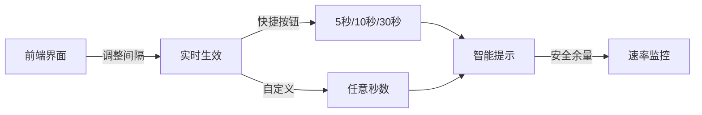
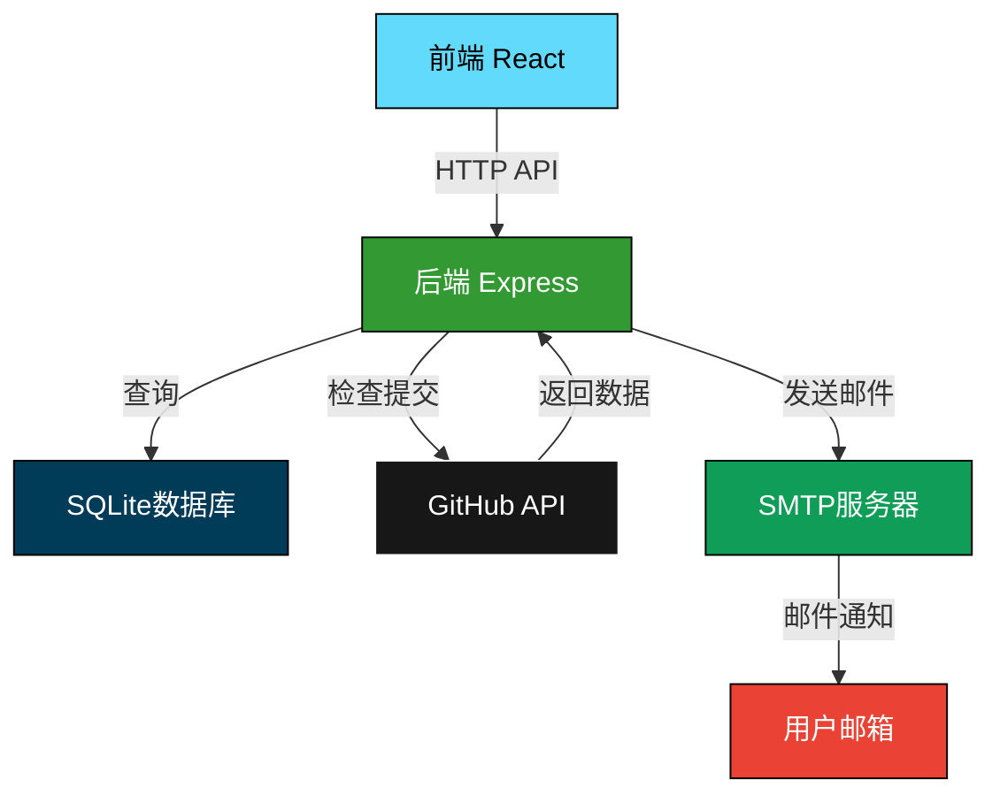
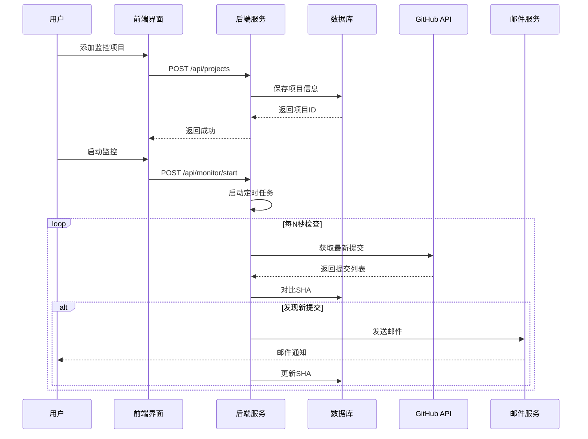

<div align="center">

<h1>🔍 GitHub监控邮箱提示系统</h1>

<p><i>实时监控GitHub仓库变更，精美邮件即时通知</i></p>

[](https://github.com/24373054/GitSentinel-Mailer/stargazers)
[](https://github.com/24373054/GitSentinel-Mailer/network)
[](https://github.com/24373054/GitSentinel-Mailer/issues)
[](https://github.com/24373054/GitSentinel-Mailer/blob/main/LICENSE)

[](https://nodejs.org/)
[](https://reactjs.org/)
[](https://expressjs.com/)
[](https://www.sqlite.org/)

[English](./README-EN.md) | [中文文档](./README.md) | [邮件主题说明](./邮件主题功能说明.md) | [动态监控说明](./动态监控间隔功能说明.md)

</div>

---

## 📖 项目简介

**GitHub监控邮箱提示系统**是一个强大而优雅的仓库变更监控工具。它能够实时追踪您关注的GitHub仓库，在检测到新提交时立即发送精美的邮件通知。

### ✨ 核心特色

<table>
<tr>
<td width="25%" align="center">

🔗  
**全链路监控**  
10秒-1小时可调

</td>
<td width="25%" align="center">

🎨  
**5种邮件主题**  
个性化视觉风格

</td>
<td width="25%" align="center">

⚙️  
**动态配置**  
前端实时调整

</td>
<td width="25%" align="center">

📊  
**智能管理**  
速率限制监控

</td>
</tr>
</table>

---

## 🌟 功能特性

### 1. 项目管理

- ✅ 添加/编辑/删除监控项目
- ✅ 支持多项目同时监控
- ✅ 数据持久化存储（SQLite）
- ✅ 实时状态显示

### 2. 实时监控

- ⚡ 灵活的监控间隔（5秒-1小时）
- 🔄 自动检测新提交
- 📝 记录详细提交信息（作者、时间、内容）
- 🎯 精准的SHA对比机制

### 3. 动态监控间隔 ⭐ 特色功能

<div align="center">



</div>

- 🎛️ 前端直接调整监控频率
- 🚀 6个快捷预设（5秒、10秒、30秒、1分钟、5分钟、10分钟）
- 📊 实时显示使用量和安全余量
- ⚠️ 智能警告速率限制
- 🔄 修改后立即生效，无需重启

### 4. 邮件主题系统 ⭐ 特色功能

<table>
<tr>
<td width="20%" align="center">

🎨  
**默认主题**  
蓝紫渐变

</td>
<td width="20%" align="center">

⬡  
**瀛州纪**  
赛博史诗

</td>
<td width="20%" align="center">

⚪  
**简约黑白**  
专业商务

</td>
<td width="20%" align="center">

🟠  
**温暖橙色**  
友好阳光

</td>
<td width="20%" align="center">

🟢  
**清新绿色**  
自然生机

</td>
</tr>
</table>

#### 瀛州纪主题特色

完美匹配《瀛州纪》游戏风格的邮件主题：

- 🌌 深邃蓝黑背景 (#0a0e27)
- ✨ 青蓝霓虹发光效果 (#00d4ff)
- 📐 矩阵网格背景装饰
- 🔮 链上记录式文案风格
- 💎 等宽字体代码展示

### 5. 智能提示系统

- 📈 实时显示API使用量
- ⚠️ 速率限制预警
- 💡 优化建议推送
- 🔑 GitHub Token状态检测

---

## 🚀 快速开始

### 环境要求

<div align="center">

| 工具 | 版本要求 | 说明 |
|:---:|:---:|:---|
| Node.js | >= 14.0 | JavaScript运行环境 |
| npm | >= 6.0 | 包管理工具 |
| Git | 最新版 | 版本控制工具 |

</div>

### 📦 安装依赖

```bash
# 克隆项目
git clone https://github.com/24373054/GitSentinel-Mailer.git
cd GitSentinel-Mailer

# 安装后端依赖
npm install

# 安装前端依赖
cd client
npm install
cd ..
```

或使用一键安装脚本：

```bash
# Windows用户
.\install.bat

# Linux/Mac用户
chmod +x install.sh && ./install.sh
```

### ⚙️ 配置环境

在项目根目录创建 `.env` 文件：

```env
# GitHub Token（可选，提高速率限制）
GITHUB_TOKEN=your_github_token_here

# 服务器端口（可选）
PORT=5000
```

### 🎯 启动服务

```bash
# 开发模式（同时启动前后端）
npm run dev

# 或分别启动
npm run server  # 后端 (端口: 5000)
npm run client  # 前端 (端口: 3000)
```

### 🌐 访问应用

打开浏览器访问：

- **前端界面**：http://localhost:3000
- **后端API**：http://localhost:5000

---

## 📱 使用指南

<div align="center">

### 三步开启GitHub监控之旅

</div>

<table>
<tr>
<td width="33%" align="center">

### 1️⃣ 添加项目

填写仓库地址  
设置通知邮箱  
选择邮件主题

</td>
<td width="33%" align="center">

### 2️⃣ 调整间隔

设置监控频率  
查看使用量预估  
确认安全余量

</td>
<td width="33%" align="center">

### 3️⃣ 启动监控

点击启动按钮  
实时接收通知  
随时查看状态

</td>
</tr>
</table>

### 详细步骤

#### 添加监控项目

1. 在左侧表单中填写：
   - **仓库地址**：格式为 `owner/repo`（例如：`facebook/react`）
   - **通知邮箱**：接收变更通知的邮箱地址
   - **邮件主题**：选择喜欢的邮件风格

2. 点击"➕ 添加项目"按钮

3. 项目出现在右侧列表中

#### 调整监控间隔

1. 在"⚙️ 监控间隔设置"面板中
2. 选择快捷按钮或自定义输入
3. 查看预计使用量和安全建议
4. 点击"💾 应用设置"

#### 启动监控

1. 在项目列表中找到要监控的项目
2. 点击"▶️ 启动监控"按钮
3. 系统开始定时检查仓库变更
4. 有新提交时自动发送邮件

---

## 🏗️ 技术架构

<div align="center">

### 技术栈

</div>

<table>
<tr>
<td width="33%" align="center">

### 后端技术


</td>
<td width="33%" align="center">

### 前端技术


</td>
<td width="33%" align="center">

### 工具库


</td>
</tr>
</table>

### 系统架构图



### 数据流向



---

## 📊 项目结构

```
github-monitor-system/
├── server/                  # 后端代码
│   ├── index.js            # Express服务器
│   ├── database.js         # 数据库操作
│   ├── monitorService.js   # 监控服务
│   ├── emailService.js     # 邮件服务
│   └── emailThemes.js      # 邮件主题
├── client/                 # 前端代码
│   ├── public/            # 静态资源
│   └── src/
│       ├── components/    # React组件
│       │   ├── ProjectForm.js
│       │   ├── ProjectList.js
│       │   └── MonitorSettings.js
│       ├── services/      # API服务
│       └── App.js         # 主应用
├── .env                   # 环境配置
├── package.json           # 后端依赖
└── README.md             # 项目文档
```

---

## 🎨 邮件主题展示

<div align="center">

### 瀛州纪主题效果

<table>
<tr>
<td width="50%">

#### 邮件头部
```
━━━━━━━━━━━━━━━━━━━━━━━━━
  ▣ 链上记录 · 数字碑文
  合约即生命 · 账本即史书
━━━━━━━━━━━━━━━━━━━━━━━━━
```

</td>
<td width="50%">

#### 提交列表
```
▸ abc1234 (青蓝发光)
  提交信息 › 修复bug
  📜 作者 · 时间

▸ def5678
  提交信息 › 新增功能
  📜 作者 · 时间
```

</td>
</tr>
</table>

</div>

---

## ⚙️ 配置说明

### GitHub Token（推荐）

使用GitHub Token可以大幅提高API速率限制：

| 类型 | 速率限制 | 适用场景 |
|:---:|:---:|:---|
| 未认证 | 60次/小时 | 1-2个项目，≥10分钟间隔 |
| 已认证 | 5000次/小时 | 多项目，≥10秒间隔 |

#### 获取GitHub Token

1. 访问 https://github.com/settings/tokens
2. 点击 "Generate new token (classic)"
3. 勾选 `public_repo` 权限
4. 生成并复制Token
5. 添加到 `.env` 文件

### 监控间隔建议

<div align="center">

| 项目数量 | 有Token | 无Token | 说明 |
|:---:|:---:|:---:|:---|
| 1-3个 | 5-10秒 | ≥60秒 | 快速响应 |
| 4-8个 | 10-30秒 | ≥120秒 | 平衡性能 |
| 9-12个 | 30-60秒 | ≥180秒 | 稳定监控 |
| 13+个 | ≥60秒 | ≥300秒 | 建议使用Token |

</div>

---

## 📚 API文档

### 项目管理API

| 接口 | 方法 | 说明 |
|:---|:---:|:---|
| `/api/projects` | GET | 获取所有项目 |
| `/api/projects` | POST | 添加新项目 |
| `/api/projects/:id` | PUT | 更新项目 |
| `/api/projects/:id` | DELETE | 删除项目 |

### 监控管理API

| 接口 | 方法 | 说明 |
|:---|:---:|:---|
| `/api/monitor/start/:id` | POST | 启动监控 |
| `/api/monitor/stop/:id` | POST | 停止监控 |
| `/api/monitor/status` | GET | 获取监控状态 |
| `/api/monitor/interval` | GET | 获取监控间隔 |
| `/api/monitor/interval` | POST | 设置监控间隔 |

### 主题管理API

| 接口 | 方法 | 说明 |
|:---|:---:|:---|
| `/api/email/themes` | GET | 获取邮件主题列表 |

---

## 🧪 测试

```bash
# 运行测试
npm test

# 验证Token配置
node 验证Token配置.js
```

---

## 🤝 贡献指南

我们欢迎所有形式的贡献！

### 如何贡献

1. Fork 本仓库
2. 创建特性分支 (`git checkout -b feature/AmazingFeature`)
3. 提交更改 (`git commit -m 'Add some AmazingFeature'`)
4. 推送到分支 (`git push origin feature/AmazingFeature`)
5. 开启 Pull Request

### 贡献者

<div align="center">

感谢所有为项目做出贡献的开发者！

[](https://github.com/24373054/GitSentinel-Mailer/graphs/contributors)

</div>

---

## 📊 项目统计

<div align="center">

### Star History

<a href="https://star-history.com/#24373054/GitSentinel-Mailer&Date">
  <picture>
    <source media="(prefers-color-scheme: dark)" srcset="https://api.star-history.com/svg?repos=24373054/GitSentinel-Mailer&type=Date&theme=dark" />
    <source media="(prefers-color-scheme: light)" srcset="https://api.star-history.com/svg?repos=24373054/GitSentinel-Mailer&type=Date" />
    
  </picture>
</a>

</div>

---

## 🛣️ 开发路线

- [x] 基础监控功能
- [x] 动态监控间隔
- [x] 多主题邮件系统
- [x] 速率限制管理
- [ ] 多用户支持
- [ ] Webhook通知
- [ ] 移动端适配
- [ ] Docker部署
- [ ] 监控历史记录
- [ ] 数据统计图表

---

## ❓ 常见问题

<details>
<summary><b>为什么收不到邮件？</b></summary>

1. 检查邮箱地址是否正确
2. 查看垃圾邮件文件夹
3. 确认项目确实有新提交
4. 查看后端控制台错误信息
</details>

<details>
<summary><b>如何提高速率限制？</b></summary>

配置GitHub Token可将限制从60次/小时提升到5000次/小时。
</details>

<details>
<summary><b>可以监控私有仓库吗？</b></summary>

可以，需要生成具有相应权限的GitHub Token。
</details>

<details>
<summary><b>监控间隔多久检查一次？</b></summary>

可自定义，范围5秒-1小时，推荐10秒-5分钟。
</details>

---

## 📄 许可证

<div align="center">

本项目采用 MIT 许可证 - 查看 [LICENSE](LICENSE) 文件了解详情

[](https://opensource.org/licenses/MIT)

</div>

---

## 🙏 致谢

<div align="center">

特别感谢以下开源项目和服务：

| 项目 | 用途 | 链接 |
|:---:|:---:|:---:|
| ⚛️ React | 前端框架 | [reactjs.org](https://reactjs.org/) |
| 🚀 Express | 后端框架 | [expressjs.com](https://expressjs.com/) |
| 📧 Nodemailer | 邮件服务 | [nodemailer.com](https://nodemailer.com/) |
| 🗄️ SQLite | 数据库 | [sqlite.org](https://www.sqlite.org/) |
| 🔨 GitHub API | API服务 | [docs.github.com](https://docs.github.com/) |

</div>

---

<div align="center">

## 💬 引言

> *"每一次代码提交，都值得被及时看见。"*  
> *"优雅的监控，从精美的通知开始。"*  
> *"让GitHub的每一次变化，都不被错过。"*  
> 
> —— GitHub监控系统

---

## 🔗 相关链接

📖 [邮件主题说明](./邮件主题功能说明.md) · 🎛️ [动态监控说明](./动态监控间隔功能说明.md) · ⚙️ [速率限制说明](./GitHub%20API速率限制说明.md) · 🧪 [测试指南](./测试指南.md)

---

**GitHub监控邮箱提示系统** © 2025

*实时监控 · 精美通知 · 智能管理*

Made with ❤️ by Community

[⬆ 回到顶部](#)

</div>
